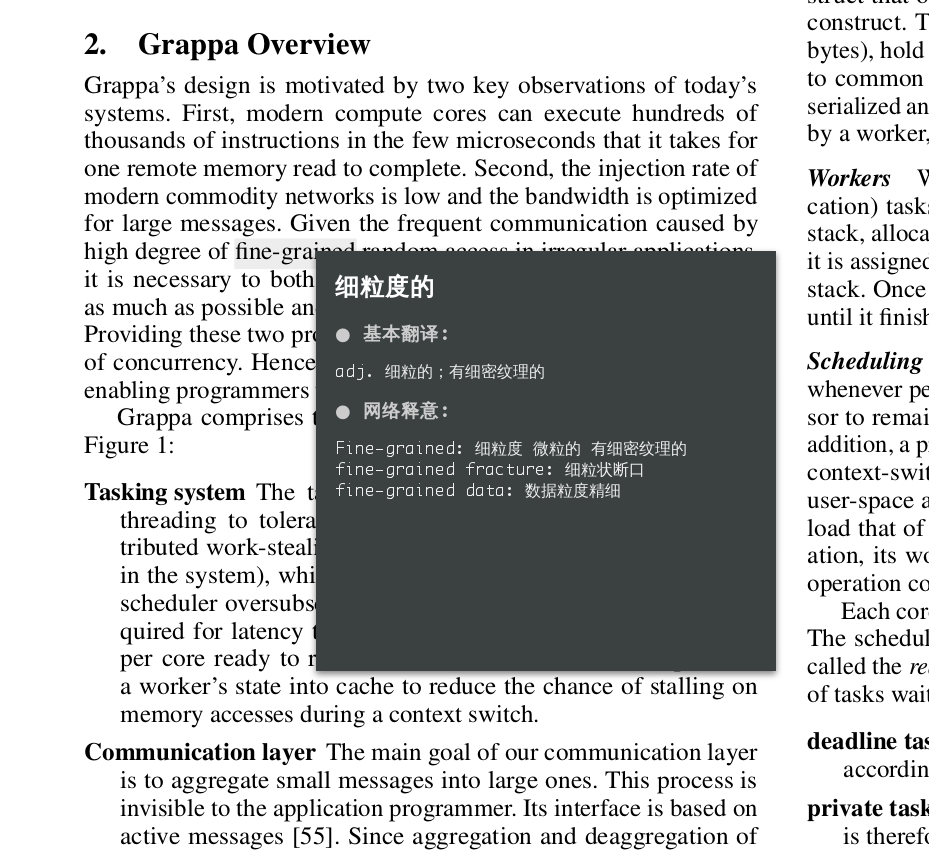
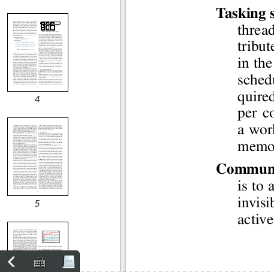

### TransME
基于pyqt的划词翻译工具,开启后，鼠标选中单词进行翻译，自动忽略选中的标点符号，程序运行在系统托盘，消耗资源极低。可以自己编写python脚本选择翻译的词典，默认使用有道。移开鼠标将关闭窗口
<table><tr>
<td></td>
<td></td>
</tr></table>
    
### Motivation
goldendict太慢(丑)，而且CPU经常占用20%。

### Requirement
- python 2.7
- pyqt 4.8+

### Usage
```shell
python transMe.py &
```
或者把他写到alias里

### Disadvantages
1. 不能响应全局按键，所以开关划词需要手动操作
2. 使用中文输入法时不能开启划词
3. 有道API比较慢，有时候会卡
